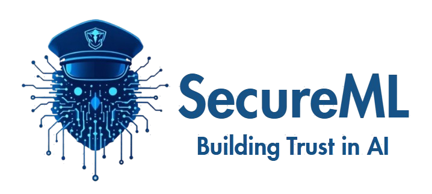

.. SecureML documentation master file, created by
   sphinx-quickstart on Sun Mar 30 09:32:12 2025.
   You can adapt this file completely to your liking, but it should at least
   contain the root `toctree` directive.

Welcome to SecureML Documentation
================================

**Privacy-Preserving Machine Learning Made Simple**

SecureML is a Python library that enables machine learning engineers to build and deploy models while maintaining compliance with privacy regulations like GDPR, CCPA, and HIPAA. 

The library provides tools for:

* **Data Anonymization**: K-anonymity, pseudonymization, and data masking
* **Privacy-Preserving Training**: Differential privacy and federated learning
* **Synthetic Data Generation**: Create realistic but private datasets
* **Compliance Checking**: Automated compliance verification
* **Audit Trails**: Comprehensive logging for documentation

.. toctree::
   :maxdepth: 2
   :caption: Contents:

   installation
   quickstart
   user_guide/index
   features/index
   examples/index
   api_reference/index
   contributing
   changelog

Indices and tables
==================

* :ref:`genindex`
* :ref:`modindex`
* :ref:`search`

